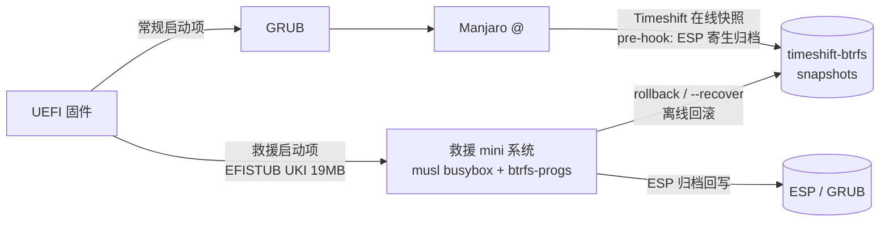

# allAuto-rollBack-inBios

[](LICENSE)
[](#%E5%BF%AB%E9%80%9F%E5%BC%80%E5%A7%8B)
[](#%E6%9E%B6%E6%9E%84)
[](#%E6%9E%B6%E6%9E%84)
[](#%E7%95%8C%E9%9D%A2)

**GRUB 和主系统全坏了，也能从固件直接引导，把 Linux + GRUB 整体回滚回去。**

一个基于 Timeshift btrfs 快照格式的独立救援系统（POC）。灵感来自
[ZFSBootMenu](https://zfsbootmenu.org)——它在 ZFS 上证明了这条路，这里是 btrfs 版。

## 这解决什么问题

Timeshift 能回滚系统，但它活在主系统里；GRUB 负责引导，却也是最容易坏的环节。
真实事故链（作者亲历）：`回滚 → mv @ → btrfs 调用全灭 → 重启 → GRUB rescue
（/@/boot/grub 不存在）→ live USB 的 Timeshift 也"不认盘"（@ 缺位）`。
**所有回滚工具共享同一个前提：根位置得有 `@`，而主系统活着。**

本项目的答案是把这个前提从回滚路径上彻底移走：

| 场景 | Timeshift | allAuto-rollBack-inBios |
|---|---|---|
| 系统正常，日常回滚 | ✅ 主场 | 可用但没必要 |
| **GRUB / 内核 / 主系统全挂** | ❌ 它自己就活在主系统里 | ✅ 固件直引，唯一手段 |
| GRUB 版本与 /boot/grub 错配 | ❌ 无处理 | ✅ ESP 寄生归档同刻回写 |
| 快照互相认可 | ✅ | ✅（格式 100% 兼容，可混用） |

## 架构



- **常规路径**：UEFI → GRUB → Manjaro。pacman 事务触发自动快照，且快照前
  ESP 先被归档进 `@/.recovery/`，与快照**原子锁定在同一时刻**
- **救援路径**：UEFI → 独立 UKI（内核 + musl busybox + btrfs-progs，单文件
  .efi，不经 GRUB）→ 只读挂载 btrfs 盘根 → 快照选择 → 回滚

## 界面

**TUI（默认）**——双栏布局：左侧快照列表（tag + ESP 归档标记），右侧所选
快照详情（备注 / live / 子卷 ID / ESP 归档状态），底部全功能键提示条：

实际渲染输出（headless 跑真实 draw 代码生成，非设计稿）：

```text
  +----------------------------------------------------------------------+
  | BTRFS RESCUE - /dev/nvme0n1p2 - 9 snapshots - restore mode           |
  |                                                |                     |
  | SNAPSHOT                       TAG        ESP  | DETAIL              |
  |  2026-09-26_17-40-48 autosnap  -               | DETAIL              |
  |  2026-09-26_19-21-51 autosnap  -               | name    2026-09-26_2|
  |  2026-09-26_19-23-51 ondemand  tar.gz          | tag     ondemand    |
  |  2026-09-26_19-25-50 ondemand  -               | comment Before resto|
  |  2026-09-26_19-38-46 autosnap  -               | live    true        |
  |  2026-09-26_19-49-19 autosnap  -               | subvol  ?           |
  |  2026-09-26_20-20-20 ondemand  -               | esp     * tar.gz    |
  |  2026-09-26_20-21-28 ondemand  tar.gz          | info.json OK        |
  |>  2026-09-26_21-18-04 ondemand  tar.gz         |                     |
  | Up/Dn select | ENTER restore | R recover | S shell | P poweroff      |
  | restore = @ swap + ESP writeback. @home is NEVER touched.            |
```

- `↑↓` 选择 · `ENTER` 回滚（二次确认）· `R` 自愈模式 · `S` 落回 shell · `P` 关机
- 回滚完成后**自动倒计时重启**，全程不碰键盘

**CLI**——同能力的命令行形态，`etc/rescue.conf` 一行 `UI=tui|cli` 切换默认
落点，两种模式运行时互通（shell 里敲 `tui` 随时进菜单）：

```text
* loading modules... + nvme-keyring + nvme-auth + nvme-core + nvme + fat + vfat
* root btrfs: /dev/nvme0n1p2 (subvolid=5, RO -> /mnt/rootfs)
* Timeshift snapshots found:
    - 2026-09-26_17-40-48
    - 2026-09-26_19-23-51
* rescue shell ready

~ # rollback
  [1] 2026-09-26_17-40-48
  [2] 2026-09-26_19-23-51
  Select snapshot [1-2, Enter=newest]: 2

=============== PLAN (restore) ===============
 1) btrfs subvolume snapshot ... -> @.new-restore
    (all btrfs work done while system is INTACT)
 2) mv @ -> timeshift-btrfs/snapshots/<now>/@   (pre-restore backup)
 3) mv @.new-restore -> @                       (two renames, ms-level window)
 4) ESP writeback if archive present (GRUB blind-spot)
==============================================
Proceed? (y/N): y
* ESP overwritten from archive
* GRUB blind-spot closed
ROLLBACK OK (restore)
```

## 工作原理

三个设计要点：

1. **快照先行（snapshot-first）** —— 回滚的所有 btrfs ioctl 在系统完整时完成
   （`snapshot → @.new-restore`），真正动系统的只有两条连续 rename，
   毫秒级窗口，任一失败**自动逆转**。对照 Timeshift 原版"先 mv 后 snapshot"
   的序列在救援环境下的致命性（见 [lessons-01](docs/lessons-01.md)）。
2. **ESP 寄生归档** —— Timeshift 至今不备份 ESP，而 GRUB 版本错配正是
   "回滚反而毁系统"的经典根因。pre-hook 把 ESP 打包进 `@/.recovery/`，
   随快照原子生成、原子清理（Timeshift 删除快照时归档自动一并删除）；
   回滚后解包回写，`grubx64.efi` 与 `/boot/grub` 严格同刻。
3. **拆解态自愈** —— `rollback --recover` 在 `@` 缺位（拆解态）时直接从
   快照重建 `@`。作者曾被迫用 live USB 走 40 分钟弯路，之后这条命令成了
   救援系统自带的后悔药。

## 快速开始

**前提**：Manjaro / Arch 系 + btrfs 根分区（`@` 子卷布局，Timeshift btrfs 模式），
UEFI 启动，无磁盘加密。

```bash
git clone https://github.com/ronman2009/allAuto-rollBack-inBios.git
cd allAuto-rollBack-inBios/poc/scripts

# 1. 固化救援内核与驱动模块（release 模式，与主系统升级解耦）
sudo ./release-pin.sh

# 2. 构建救援镜像（13 项自检全绿才出镜像）
./build-initramfs.sh                # 产物: build/recovery.efi (19MB UKI)

# 3. 注册救援启动项 + 安装主系统侧组件
sudo ./install-phase1.sh --bootnext # 下次启动进救援
sudo ./install-host.sh              # ESP 寄生归档 hook + rescue-snapshot

# 4. 验证
sudo rescue-snapshot --comments "整体快照" --tags O   # 快照自动携带 ESP 归档
sudo reboot                                           # 进救援 TUI
```

## 兼容性与边界

- ✅ Timeshift btrfs 快照 100% 兼容：识别、回滚、pre-restore 快照互相认可，可混用
- ✅ 回滚白名单只含 `@` 与 ESP——`@home` 永不触碰，桌面文件/文档零风险
- ✅ Secure Boot 预留：UKI 单文件签名即可启用（当前默认关闭）
- ✅ TUI 运行时输出纯 ASCII：任何 locale、任何 console 字体下无乱码
- ⚠️ **救援镜像与救援内核版本写死**（release 模式）：主系统升级内核后需重跑
  `release-pin.sh + build-initramfs.sh + install-phase1.sh`（正式版计划 pacman hook 自动化）
- ⚠️ **不承诺硬件级灾难**：固件损坏、磁盘故障、btrfs 元数据损坏无解——任何方案都无解
- ⚠️ **无 LUKS**：加密盘未支持
- 🔄 Timeshift 的 rsync 模式不支持，仅 btrfs 模式

## 工程质量

- 破坏性脚本铁律：**先验证全部工具可用，再动第一刀**——preflight 硬门禁 + `set -u`
- 构建自检 **13 项断言**（init / busybox / dev-console 节点 / NVMe+FAT 模块 /
  btrfs / rollback 防线 / tui / rescue.conf / UKI PE 结构），任一失败拒绝出镜像
- 内核驱动模块化清单一次查全（NVMe 系 + FAT/vfat），构建期从当前内核解压钉入
- v3 回滚序列：btrfs 失败全部发生在系统完整时；窗口内失败自动 revert
- **事故留档不藏丑**：[incident-01](docs/incident-01.md) 记录了 v2 把作者自己
  系统爆破（40 分钟人工恢复）的完整根因链——教训全部转化为上述防线

## 文档

| 文档 | 内容 |
|---|---|
| [`docs/research-01.md`](docs/research-01.md) | 实机勘察、Timeshift 快照格式、ZFSBootMenu 参照 |
| [`docs/research-02.md`](docs/research-02.md) | BSD 否决论证、Secure Boot（UKI/sbsign）预留设计 |
| [`docs/audit-01.md`](docs/audit-01.md) | 分层风险矩阵与防线 |
| [`docs/incident-01.md`](docs/incident-01.md) | P0 事故报告：v2 爆破作者系统全记录 |
| [`docs/lessons-01.md`](docs/lessons-01.md) | 全链路复盘：快照建立 → Timeshift 回滚 |
| [`docs/poc-phase01.md`](docs/poc-phase01.md) / [`poc-phase3.md`](docs/poc-phase3.md) | 操作手册 |

## 进度

- [x] 阶段 0：Timeshift btrfs 模式修复与验证
- [x] 阶段 1：EFISTUB UKI 独立引导（实测通过）
- [x] 阶段 2：快照枚举（实测通过）
- [x] 阶段 3：离线回滚 + ESP 寄生归档（实机验收通过）
- [x] 阶段 4：ANSI TUI 快照菜单（双模切换，实测通过）
- [ ] 正式版：recovery 分区 squashfs A/B 双镜像、Secure Boot 签名、pacman hook 自动重建

## License

[MIT](LICENSE) © 2026 ronman2009
